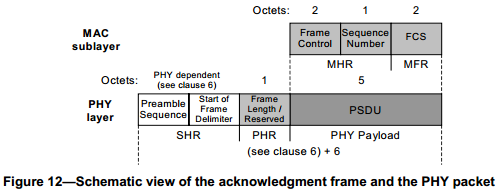
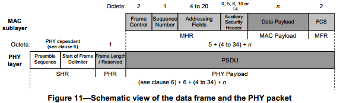

# readme-ack

在很多协议中接收方收到一帧数据后都会回应一个确认帧，表示已正确接收到数据。

本练习中，确认帧和数据帧如下图所以：

原本打算使用802.15.4-2006帧格式，但协议并没有支持FSK和433MHz频段（目前手头有的是433MHz频段cc1101测试板）。参考802.15.4-2011版本协议

其中：

**preamble sequence**为0101流，32 symbol；

**start of frame delimiter**：

| Bits: 0 | 1    | 2    | 3    | 4    | 5    | 6    | 7    |
| ------- | ---- | ---- | ---- | ---- | ---- | ---- | ---- |
| 1       | 1    | 1    | 0    | 0    | 1    | 0    | 1    |

**length**:

The Frame Length field specifies the total number of octets contained in the PSDU (i.e., PHY payload). It is
a value between 0 and aMaxPHYPacketSize, as described in 9.2. Table 72 summarizes the type of payload
versus the frame length value 

### 应答帧

Frame Control field

The Frame Control field contains information defining the frame type, addressing fields, and other control
flags. The Frame Control field shall be formatted as illustrated in Figure 36.

001 data frame; 010 ACK

## 练习内容

​	模块A尝试发送一帧数据给模块B，如果没有收到确认帧（1s超时），则重发；最多重发5次；如果收到应答则发送成功，否则发送失败；